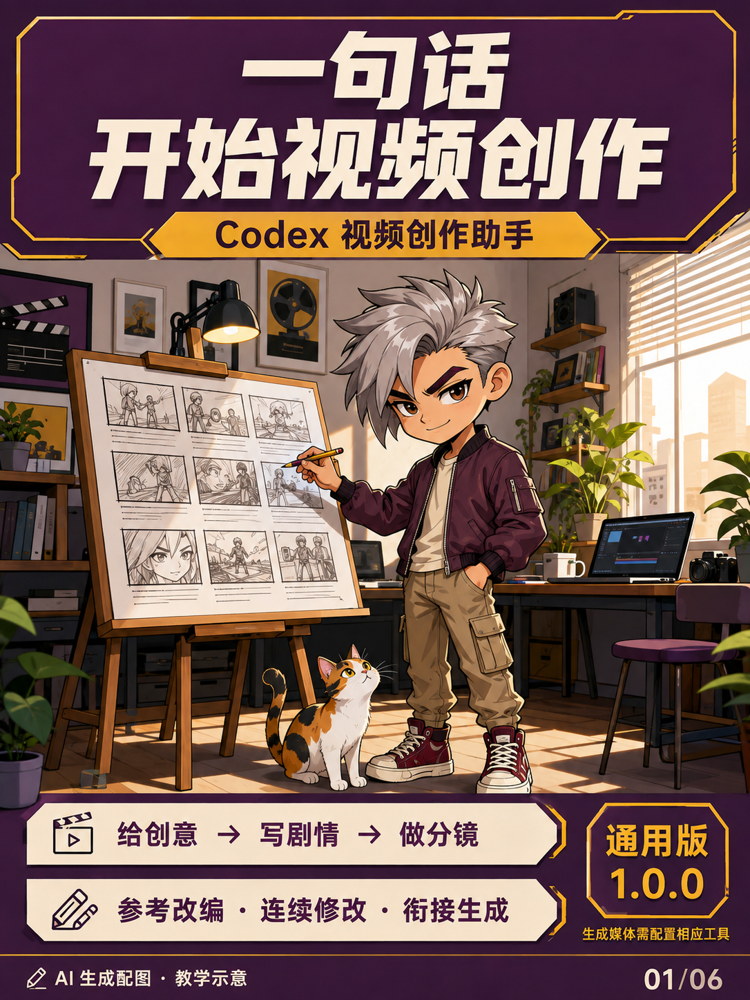

# Video Creation Agent · 通用视频创作助手

在 Codex 里直接说“帮我做一个……视频”，或附上参考内容说“保留这个节奏，换一个剧情”。

这是一个自包含的 Codex skill 插件：理解需求、选择创作结构、分析可读取的参考、写剧本和镜头提示词，再衔接用户自己配置的生成工具。无需记模板编号。



图解入门：[六图使用指南](docs/visual-guide.md)。配图是 AI 生成教学示意。

**它不是视频生成模型，也不包含生成额度。** 只写剧本不需要视频 API；实际生图、生成视频、音频转写和视频解码取决于当前 Codex 环境的工具。

## 使用示例

> 帮我做一个牛追着人跑的搞笑视频，8秒，先写剧本。

> 参考这个视频的剪辑节奏，换成一只猫寻找主人的剧情。

> 主角换成机器人，保留刚才的镜头和结尾。

> 出首帧。 / 就用这张做视频。

## 安装：两种方式任选一种

### 方式 A：作为独立 skill 使用

将 `plugins/video-creation-agent/skills/video-creation-agent` 整个文件夹复制到用户的 `~/.agents/skills/` 下。Windows 的 `~` 表示用户目录。目标已有同名 skill 时先备份再决定是否替换。不要同时安装两个同名版本。

打开一个新的 Codex 对话。可以直接描述创作需求；如果环境中多个技能同时匹配，可明确说“使用 video-creation-agent”，或按下文配置入口优先规则。

### 方式 B：通过插件市场安装

需要支持 `codex plugin` 命令的 Codex CLI。在克隆/解压后的仓库根目录执行：

```sh
codex plugin marketplace add .
codex plugin add video-creation-agent@video-creation-public
```

市场文件位于 `.agents/plugins/marketplace.json`，插件位于 `plugins/video-creation-agent`。新建对话以加载。若 CLI 不支持插件子命令，使用方式 A。发布者的本机公司或个人插件不是本项目的安装依赖。

## 自动入口

已允许隐式调用，但这不保证所有环境都会优先选中它。需要统一入口时，把以下规则加入**你希望生效的项目**的 AGENTS.md（保留原规则），并在新对话验证：

> 普通自然语言视频创作与参考改编，先读取已安装的 video-creation-agent SKILL.md，再按其流程执行；用户明确指定其他流程时遵从用户。视频播放、格式转换、压缩和纯技术排错不强制经过此入口。找不到该 skill 时说明缺失，不虚称调用。

仓库自带的 AGENTS.md 只对在本仓库内工作的会话起作用。安装插件不会自动修改其他项目或用户全局规则。

## 能力与边界

| 功能 | 所需条件 |
|---|---|
| 需求理解、原创剧情、分镜、镜头提示词 | Codex；本包已包含通用规则 |
| 图片参考 | 当前会话有视觉读取能力 |
| 视频参考 | 可读取视频，或具备解码/抽帧及视觉能力 |
| 语音参考 | 当前环境有可用音频理解或转写工具 |
| 首帧/视频生成 | 用户自选并配置的实际生成工具及授权 |

模型和生成平台由使用者选择。没有生成工具时会交付提示词与参数清单，明确尚未生成媒体。对话状态由执行中的助手按需要保存，不是插件附带的独立数据库或常驻服务。

## 项目结构

```text
.agents/plugins/marketplace.json
plugins/video-creation-agent/.codex-plugin/plugin.json
plugins/video-creation-agent/skills/video-creation-agent/
  SKILL.md
  agents/openai.yaml
  references/
docs/examples.md
docs/xiaohongshu.md
scripts/validate_release.py
```

## 验证与贡献

运行 `python scripts/validate_release.py` 检查发布文件和相对引用。人工行为验收见 `docs/examples.md`。不要把生成结果、账号凭据、用户素材和运行日志提交到仓库。

本次发布包完成结构、引用与内容检查；外部生成服务未做全平台兼容性验收。请按自己的工具环境验证实际出图/视频流程。

按 MIT License 发布。项目不附带任何第三方媒体素材或额外模型授权。
