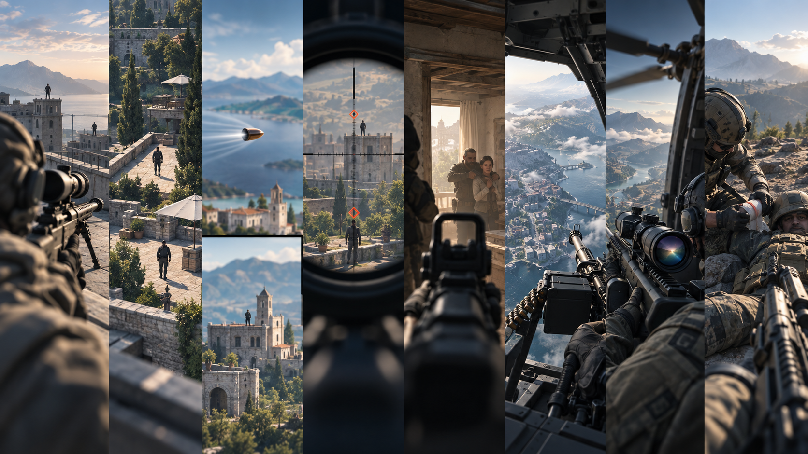

# VID Skill 全景目录

本页把当前 8 个 VID 工作流集中到一个入口。它们分别解决不同的第一人称狙击、弹道、界面、航空平台和战术救援问题；选择对应口令即可让 Codex 读取相应工作流。

> 配图为 Codex 内置 `imagegen` 新生成的公开教学示意，不是公司项目截图，也不是任何成片承诺。

## 统一的公开生成方案

本公开说明不依赖公司内部生图或视频服务：

- **图片**：使用 Codex 内置 `imagegen` 生成或局部修改，并在提交视频前检查人物、手部、武器、空间、UI 和画幅。
- **视频**：使用你**已配置并有权限使用的 Seedance 2.5 入口**。入口可以是官方界面、公开 API，或你自行配置的兼容工具；不要写死私有域名、账号、密钥、工作区 ID 或内部模型别名。
- **不可用时**：交付完整导演稿、提示词、参考素材顺序和参数清单，明确标注“尚未生成”，不静默换平台、不降级模型、不重复付费提交。
- **提交门槛**：先通过首帧与素材顺序检查，再获得当前这次生成的明确授权。提交后记录平台返回的任务 ID；失败或任务丢失时先查询，不自动重提。
- **母版边界**：替换的是生成入口，不是 VID 的时间线、画幅、UI、安全区、素材顺序、命中结局或连续性规则。

图中从左到右依次代表：导演稿与分镜 → `imagegen` 首帧 → 视觉审核 → Seedance 2.5 有声视频。

## 快速选择

| 口令 | 工作流 | 默认规格 | 核心特征 | 适合场景 |
|---|---|---|---|---|
| `VID-001` | W 狙击高价值目标 `w-sniper-high-value-target` | 14 秒 · 9:16 · 有声 | 双目标、固定任务 UI、击发、Bullet-Cam、结果与回切 | 需要完整任务叙事和高价值目标升级感 |
| `VID-002 命中` / `VID-002 未击中` | 无 UI 瞄准多人 `vid-002-no-ui-multi-target` | 15 秒 · 9:16 · 有声 | 多目标、无 HUD、单张首帧、弹尾 Bullet-Cam | 想突出写实镜头和多人空间关系 |
| `VID-003 命中` / `VID-003 未击中` | 上下双屏狙击 `vid-003-split-screen-sniper` | 12 秒 / 8 秒 · 9:16 | 单目标、上下 50:50、弹道与目标同一世界时钟 | 需要同时看见子弹推进与目标动作 |
| `VID-004 未击中` | 新 UI 双目标狙击 `vid-004-new-ui` | 10 秒 · 9:16 · 有声 | 两次锁定、新任务 UI、直线 Bullet-Cam、接触前结束 | 展示任务等级与目标切换但不表现命中 |
| `VID-005` | 提高命中率解救人质 `vid-005-hostage-sniper-ui` | 8 秒 · 9:16 · 720p · 有声 | 人质风险值、DANGER、固定圆形瞄准镜、精确 UI 合成 | 需要瞄准点风险变化和人质识别 |
| `VID-006 高空射击版` | 航空平台高空射击 `vid-006-high-altitude-shooting` | 12 秒 · 9:16 · 有声 | 舱门重机枪、双目标任务 UI、平台运动、连续射击 | 航空平台压迫感和高速空对地镜头 |
| `VID-006 高空狙击版` | 航空平台单发狙击 `vid-006-high-altitude-sniper` | 12 秒 · 9:16 · 720×1280 · 有声 | 二战/现代、直升机/固定翼、清晰光学瞄准镜、单发 Bullet-Cam | 强调平台视差、枪架可信度和单发连续性 |
| `VID-007` | 第一人称战术救援 `vid-007-first-person-tactical-rescue` | 15 秒 · 9:16 · 720p · 有声双候选 | 短救治、转向开镜、敌方升级、交火、结果确认 | 需要“救人开场 + 完整交战”的连续动作链 |

## VID-001 · W 狙击高价值目标

触发口令：`VID-001` 或“W 狙击高价值目标”。

- 固定 14 秒九段结构：高地备战、快速开镜、普通目标、高价值目标、击发、Bullet-Cam、结果、反击、回切。
- 普通目标与核心目标必须相隔至少 10 米，先后进入同一个高倍率瞄准镜，不能同框或交换任务 UI。
- 新首帧用 `imagegen`；既有普通目标 UI、高价值目标 UI 和运镜参考只按其角色绑定，不继承旧剧情。
- 视频由已配置且有权限的 Seedance 2.5 入口一次提交两个候选；保留 14 秒、9:16、音频和完整九段，不按参考视频时长截断。

适合：完整任务故事、目标价值升级、命中或未命中分支。

## VID-002 · 无 UI 瞄准多人

触发口令：`VID-002 命中` 或 `VID-002 未击中`。只说 `VID-002` 时，先选择结局。

- 固定 15 秒；无 HUD、任务标签、资源条或奖励数字，光学瞄准镜和物理十字线不算 UI。
- 只允许一张首帧参考；多人身份、服装、道具和位置必须稳定。
- “未击中”是镜头在接触前结束，不是子弹偏转或改换目标。
- 使用 `imagegen` 生成首帧，Seedance 2.5 生成两个 9:16 有声候选。

适合：去游戏化视觉、多目标空间连续性、写实弹道镜头。

## VID-003 · 上下双屏狙击

触发口令：`VID-003 命中` 或 `VID-003 未击中`。只说 `VID-003` 时，先选择结局。

- 单一目标、9:16、第一人称常规狙击；未击中版 8 秒，命中版 12 秒。
- 双屏出现后，上屏看弹道与远处目标，下屏放大同一目标；两屏必须共享世界坐标、动作相位和时间。
- 先生成开场首帧，再以它为强参考生成双屏关键帧；两张图均用 `imagegen`。
- 将两张合格图片和唯一运动参考一次绑定给 Seedance 2.5，每个候选必须是一条完整连续成片，禁止拆段后拼接。

适合：弹道推进、目标动作与双屏同步的可视化表达。

## VID-004 · 新 UI 双目标狙击

触发口令：`VID-004 未击中`。

- 固定 10 秒、9:16、有声；高地开场、快速开镜、两次目标锁定、击发和直线 Bullet-Cam。
- 普通目标与高价值目标分别绑定固定 UI；素材顺序、UI 安全区和弹丸外观参考不可互换。
- 首帧和需要补充的关键图由 `imagegen` 独立生成并审核。
- Seedance 2.5 必须保持未击中合同：在弹丸抵达目标面前时直接结束，不添加命中、结算或失败画面。

适合：新任务 UI、等级递进、目标切换和接触前悬停结尾。

## VID-005 · 提高命中率解救人质

触发口令：`VID-005` 或“解救人质狙击”。

- 先确认建立镜头，再制作干净无 UI 母版；五个风险 UI 关键帧从同一母版确定性合成，避免人物和背景漂移。
- 瞄准镜必须是完整 1:1 圆形；瞄准人质显示 `DANGER`，瞄准不同身体区域时风险值和颜色按规则变化。
- 建立镜头与干净母版用 `imagegen`；精确百分比 UI 由本地脚本合成，不让视频模型重写数字。
- Seedance 2.5 只负责真实场景、动作、瞄准与 Bullet-Cam；视频提交前核对素材数量、顺序、角色和因果链。

适合：人质识别、瞄准点决策、需要像素级稳定 UI 的玩法演示。

## VID-006 · 高空射击版

触发口令：`VID-006 高空射击版`。不要与高空狙击版混用。

- 固定 12 秒航空平台结构，突出平台运动、双目标任务 UI、舱门重机枪和空对地连续射击。
- 适用于机枪或高空射击改编；保留平台、武器、参考包和弹道连续性，不套用单发狙击版的 12 秒母版。
- 新场景图由 `imagegen` 生成，固定 UI 和经过确认的运动参考只承担各自角色。
- Seedance 2.5 生成时保持航空平台视差、目标可见性和素材顺序；不能把 UI、人物或弹道参考互相污染。

适合：高空火力、航空平台节奏和强烈俯视空间。

## VID-006 · 高空狙击版

触发口令：`VID-006 高空狙击版`、航空平台单发狙击等。不要用于机枪、点射或曳光弹流。

- 固定 12 秒、9:16、720×1280、有声；二战或现代，直升机或慢速固定翼，每条只选一套。
- 狙击步枪必须从首帧起清晰展示可信的光学瞄准镜、镜座和枪架；平台前景刚性同步，地面保持连续视差。
- 新场景首帧使用 `imagegen`，先检查时代、平台、枪架、瞄准镜、场景、构图和光线。
- 三张图片与唯一视频参考一次提交到 Seedance 2.5；9.6 秒单发，随后立即进入 Bullet-Cam，在接触前结束。

适合：航空平台物理感、单发狙击、目标跨 Bullet-Cam 动作连续性。

## VID-007 · 第一人称战术救援

触发口令：`VID-007` 或“第一人称战术救援”。

- 默认现代真人、15 秒、9:16、720p、有声；每段一次生成同一剧情的 A/B 两个候选。
- 固定因果链：近距离救治 → 收起道具/转向 → 举枪开镜 → 观察敌人 → 敌方动作升级 → 交火 → 结果确认。
- 带完整 HUD 的首帧由 `imagegen` 生成，人物手部、接触关系、空间和 UI 遮挡必须先审。
- 视频使用已配置且有权限的 Seedance 2.5 入口；提交一张已确认图片和完整导演稿，保留音频，不改成旧版或快速模型。

适合：救援互动与狙击交战连接成一条完整、可见的动作链。

## 使用方式

在 Codex 里直接输入对应口令并补充场景即可，例如：

> VID-003 未击中。二战山地通信站，目标正在持续转动手摇发电机，明亮自然光。

> VID-006 高空狙击版。现代直升机，沿海雷达站，核心目标持续操作天线控制杆。

> VID-007。先帮助被倒塌木梁压住的队友，再转向远处仓库开镜交战。

推荐按以下顺序推进：

1. 确认 VID 编号、变体、场景、时代、时长和画幅。
2. 输出完整导演稿，检查动作起点、执行过程和可见结果。
3. 用 `imagegen` 生成首帧并完成视觉审核。
4. 核对图片/视频参考的数量、顺序和作用边界。
5. 获得本次生成授权后，通过已配置且有权限的 Seedance 2.5 入口提交。
6. 区分技术可解码、视觉合格和用户最终选定；多候选必须等待用户选择。

## 公开边界

本目录是公开使用说明，不包含账号凭据、私有接口、内部任务记录、公司机器人配置或未授权项目素材。若要把某个 VID 工作流做成可公开安装的完整包，需要逐项确认固定 UI、视频参考和其他二进制资产的公开许可；在许可不明时，只公开工作流说明和自行生成的教学示意图。
