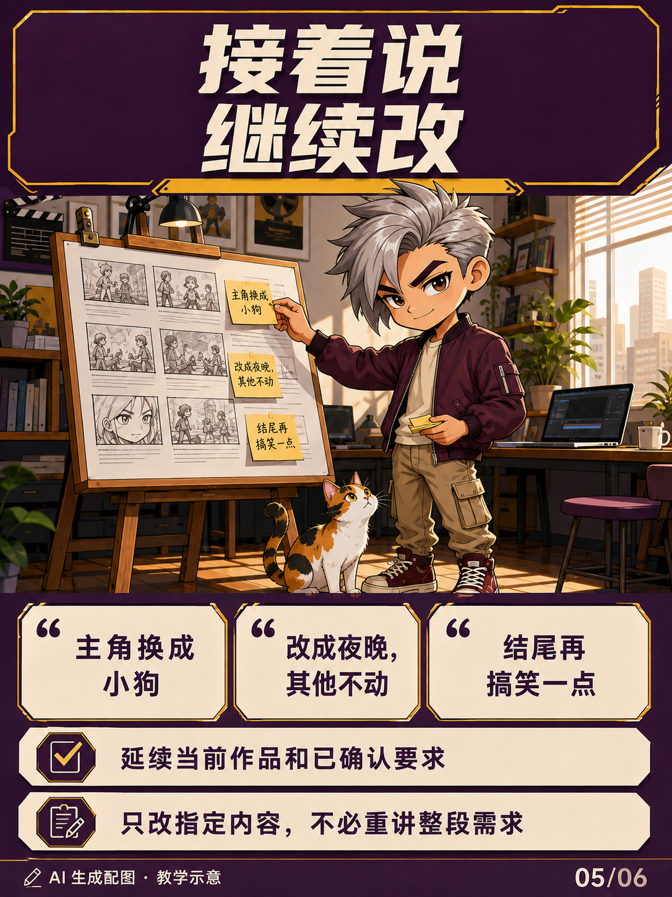

# 六图使用指南

配图为 AI 生成的教学示意，不是实际软件截图或生成结果证明。

## 01 一句话开始视频创作

直接描述主题、剧情或参考用途。助手组织创作流程，媒体生成需要另外配置相应工具。

## 02 安装与新建对话

本页展示独立 skill 安装方式。发布包内的完整路径是 `plugins/video-creation-agent/skills/video-creation-agent`；把最后这个文件夹复制到用户的 `~/.agents/skills/`。`~` 代表用户主目录。已有同名版本先备份。插件市场安装方式见 [README](../README.md)。

## 03 直接说出创意

> 帮我做一个牛追着人跑的搞笑视频，8秒，先写剧本。

如果已有其他同类 skill 抢先匹配，可以按 README 的“自动入口”部分配置项目规则。隐式调用不是绝对优先。

## 04 参考改编

> 参考这个视频的节奏，换成一只猫寻找主人的剧情。

视频分析取决于环境中的读取、解码或抽帧及视觉能力。不能读取时应说明，不假装已经看过。

## 05 连续修改

> 主角换成小狗。改成夜晚，其他不动。结尾再搞笑一点。

修改延续同一作品；新作品不套用旧角色或旧授权。

## 06 从分镜到生成

实际视频生成需用户选择并配置可用工具。付费前确认完整方案；没有工具时交付提示词与参数，不能声称已经生成。
